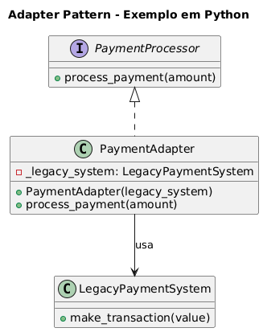

# Padrão Adapter - Exemplo de Processamento de Pagamentos

## Visão Geral
Este exemplo demonstra a implementação do **Padrão Adapter** para integrar um sistema legado de pagamentos com uma interface moderna. O padrão permite que classes com interfaces incompatíveis trabalhem juntas.

## Estrutura do Padrão

### Interface Alvo
- `PaymentProcessor` - Interface moderna que define o contrato esperado pelo sistema atual

### Classe Adaptada (Legacy)
- `LegacyPaymentSystem` - Sistema antigo com interface incompatível que não pode ser modificado

### Adapter
- `PaymentAdapter` - Converte a interface moderna para a interface legada

## Principais Benefícios

1. **Reutilização de Código** - Permite usar sistemas legados sem reescrevê-los
2. **Compatibilidade** - Integra interfaces incompatíveis de forma transparente
3. **Separação de Responsabilidades** - Mantém a lógica de adaptação isolada
4. **Flexibilidade** - Facilita a migração gradual de sistemas

## Implementação

### Interface Moderna
```python
class PaymentProcessor(ABC):
    @abstractmethod
    def process_payment(self, amount: float) -> None:
        pass
```

### Sistema Legado
```python
class LegacyPaymentSystem:
    def make_transaction(self, value: float) -> None:
        print(f"[LEGADO] Pagamento realizado no valor de R$ {value:.2f}")
```

### Adapter
```python
class PaymentAdapter(PaymentProcessor):
    def __init__(self, legacy_system: LegacyPaymentSystem) -> None:
        self._legacy_system = legacy_system

    def process_payment(self, amount: float) -> None:
        # Adiciona taxa de 1% e chama o sistema legado
        amount += amount * 0.01
        self._legacy_system.make_transaction(amount)
```

## Exemplo de Uso
```python
legacy = LegacyPaymentSystem()
processor = PaymentAdapter(legacy)
processor.process_payment(150.00)
```

## Saída
```
[LEGADO] Pagamento realizado no valor de R$ 151.50
```

## Quando Usar
- Quando você precisa usar uma classe existente com interface incompatível
- Quando você quer integrar bibliotecas de terceiros com seu sistema
- Quando você precisa fazer sistemas legados funcionarem com código novo
- Quando você quer criar uma camada de abstração sobre APIs externas
- Durante migrações graduais de sistemas antigos